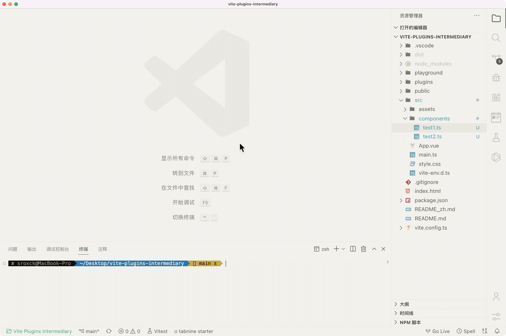

# vite-plugin-intermediary
自动创建导入导出中转文件，通常用于多文件导出统一单文件导入路径   




## Feature

- 识别`default` 或 `named`
- 追加写,不影响主动导出的内容
- 缓存监听,修改export内容触发中转文件更新

## Requirement

- node version: >=14


## Install

``` zsh
pnpm i vite-plugin-intermediary -D
```


## Usage


``` js
import { defineConfig } from 'vite'
import Intermediary from 'vite-plugin-intermediary'
export default defineConfig({
  plugins: [Intermediary({
    dir:'src/components',
    output:'index.ts',
  })]
})
```

## Options


``` ts
export interface Intermediary {
  dir: string, // 需要监听的目录
  include?: includeOptins[] // 包含的文件类型数组
  output: string, // 输出的中转文件
  auto?:boolean, // 是否自动扫描并生成,默认false
}
export type includeOptins = 'ts' | 'js' | 'vue' | 'md'

```


